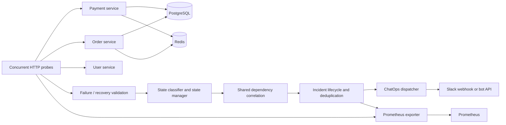

# Healthcheck Sentinel

Detect zombie microservices whose process is alive (`/healthz` returns 200) while critical PostgreSQL or Redis dependencies are unavailable. Monitoring is deterministic Python; no runtime AI is used.

## Architecture



FastAPI/Uvicorn services use the asyncio event loop to isolate DNS lookups during missing-container failures; payment/order also bound DNS retries in Compose. They use asyncpg `SELECT 1` and Redis `PING`. The asyncio agent uses HTTPX, Prometheus client, and psutil. User-service has no external dependencies. Payment/order expose demo business endpoints backed by in-memory lists; they are not production transaction systems.

| State | Meaning |
|---|---|
| HEALTHY | Liveness, readiness and required dependency evidence pass |
| DEGRADED | Process responds but has optional failures or inconclusive/inconsistent readiness evidence |
| ZOMBIE | Process responds, readiness fails, and a critical dependency reports failure |
| DOWN | The service's liveness endpoint is unreachable |

Three failing observations separated by one-second retries confirm an outage; two successful observations confirm recovery. A four-second pause separates polling batches. Concurrent service checks are correlated before incident dispatch, so payment/order failures on PostgreSQL produce one shared incident. DOWN takes precedence over dependency attribution. Pending recovery preserves confirmed failure evidence.

The incident JSON includes `incident_id`, `status` (ACTIVE/RESOLVED), `state`, `root_cause`, `affected_services`, `first_failure_time`, `confirmation_time`, `recovery_time`, `detection_time_seconds`, `explanation`, and `evidence`. `state` on a resolved incident describes the original outage; current service state is in `/status`.

## Setup and Docker demo

Prerequisites: Docker Desktop with its Linux engine running, Docker Compose, and Python 3.11+ for tests/demo automation. Run commands from this repository.

```powershell
if (-not (Test-Path .env)) { Copy-Item .env.example .env }
python -m venv .venv
.\.venv\Scripts\python.exe -m pip install -r services/requirements-dev.txt
# Local HTTP recorder receives Slack payloads; no workspace messages are sent.
docker compose -f docker-compose.yml -f docker-compose.demo.yml up -d --build
.\.venv\Scripts\python.exe scripts/docker_demo.py --full
docker compose -f docker-compose.yml -f docker-compose.demo.yml ps
```

On Linux/macOS use `.venv/bin/python` after `python3 -m venv .venv`.

The default demo script stops PostgreSQL, proves `/healthz=200` and `/readyz=503`, waits for a shared ZOMBIE incident, holds the outage across repeated polls, checks one ACTIVE payload, restores PostgreSQL in a `finally` block, and checks one RESOLVED payload. `--full` also tests Redis, payment process shutdown, a short Redis pause, and a 60-second healthy CPU sample. It writes actual results to `docs/validation-results.json`. A failed assertion stops the demo rather than fabricating a successful report. Do not run simultaneous failure scripts during validation.

Manual controls (PowerShell; matching `.sh` scripts are included):

```powershell
./scripts/fail_postgres.ps1
./scripts/recover_postgres.ps1
./scripts/fail_redis.ps1
./scripts/recover_redis.ps1
./scripts/stop_payment.ps1
./scripts/restart_payment.ps1
```

These operate only on named Compose services and preserve volumes. After an interrupted demo, use `docker compose start postgres redis payment-service`. Do not use `down -v` unless you intend to erase local data.

Endpoints:

- Payment: http://localhost:8001/healthz and `/readyz`
- Order: http://localhost:8002/healthz and `/readyz`
- User: http://localhost:8003/healthz and `/readyz`
- Read-only agent evidence/incidents/notification receipts: http://127.0.0.1:9101/status
- Metrics: http://127.0.0.1:9100/metrics
- Prometheus: http://localhost:9090
- Demo webhook messages: http://127.0.0.1:18080/messages

All published Compose ports bind to host loopback, including readiness, databases, metrics and Prometheus. The status endpoint is unauthenticated and has no mutation/restart operations; keep it private. Compose is a local development environment, including its database defaults.

## Configuration

Secrets come from environment variables; `.env` is ignored by Git and excluded from Docker build contexts. Never paste tokens into logs or reports.

| Variables | Purpose / defaults |
|---|---|
| `PAYMENT_DB_URL`, `ORDER_DB_URL` | PostgreSQL connection strings; override demo defaults together with database settings |
| `PAYMENT_REDIS_URL`, `ORDER_REDIS_URL` | Redis URLs, DB 0 and 1 in Compose |
| `POSTGRES_DB`, `POSTGRES_USER`, `POSTGRES_PASSWORD` | Local database initialization; changing these does not migrate an existing volume |
| `DB_CONNECT_TIMEOUT`, `REDIS_CONNECT_TIMEOUT` | Per dependency operation timeout, 0.5 seconds by default |
| `PAYMENT_SERVICE_URL`, `ORDER_SERVICE_URL`, `USER_SERVICE_URL` | Agent target addresses; Compose supplies internal DNS URLs |
| `SERVICE_REGISTRY_JSON` | Optional registry array: name, base_url, healthz_path, readyz_path, critical_dependencies |
| `AGENT_POLL_INTERVAL_SECONDS` | 4 seconds between polling batches |
| `AGENT_FAILURE_THRESHOLD`, `AGENT_RECOVERY_THRESHOLD` | 3 failures / 2 successes |
| `AGENT_RETRY_DELAY_SECONDS`, `AGENT_TIMEOUT_SECONDS` | 1-second retry delay / 3-second HTTP timeout |
| `METRICS_PORT`, `STATUS_PORT`, `AGENT_LOG_LEVEL` | 9100 / 9101 / INFO |
| `SLACK_WEBHOOK_URL` | Incoming webhook; takes precedence over bot token |
| `SLACK_BOT_TOKEN`, `SLACK_ALERT_CHANNEL` | Bot API token and destination channel ID |
| `SLACK_SIGNING_SECRET` | For request verification if an interactive backend is later added |

Compose explicitly configures monitoring defaults. To tune them, edit Compose or supply an override; exporting an agent variable on the host alone does not replace a literal Compose environment value.

## Slack

Configure either an incoming webhook or a bot with `chat:write` access to the chosen channel. Set credentials privately in `.env`, then run the base stack:

```powershell
docker compose up -d --build --force-recreate monitoring-agent
```

Do not include `docker-compose.demo.yml` when sending real Slack alerts: that override intentionally routes to the local recorder. No actual Slack workspace delivery is implied by recorder success.

Each incident lifecycle transition receives at most one delivery attempt per agent process. Repeated polls cannot duplicate it; HTTP errors, API `ok:false`, and exceptions are recorded as failed deliveries without crashing monitoring. Attempts are not automatically retried, because an ambiguous webhook timeout could already have posted the message. Production use needs a durable outbox and explicit retry policy. Delivery is bounded by a 10-second HTTP timeout and currently awaited before the next poll.

View Logs and Restart were placeholder controls. They are not included in outgoing alerts, and their handlers return `disabled`. No unauthenticated restart API or Docker socket mount exists. Use authenticated local Docker or Kubernetes operator commands. Slack request verification checks signature and timestamp freshness, but no interactive HTTP endpoint is deployed.

## Prometheus

| Metric | Interpretation |
|---|---|
| `healthcheck_service_status{service,state}` | One-hot gauge: 1 for current confirmed state, 0 for others |
| `healthcheck_probe_duration_seconds{service,probe_type="combined"}` | Histogram for concurrent health/readiness HTTP probe duration |
| `healthcheck_probe_failures_total` | Failed endpoints with bounded status/reason labels |
| `healthcheck_detection_seconds` | First failed probe completion to confirmation; excludes pre-poll wait |
| `healthcheck_incidents_total{root_cause,status="ACTIVE"}` | Number of incidents created |
| `healthcheck_active_incidents` | Active incident count; resets to zero on resolution |
| `healthcheck_process_cpu_percent` | Agent CPU utilization relative to one logical core |
| `healthcheck_process_memory_bytes` | Resident agent memory |

Prometheus scrapes the agent every five seconds. Rules detect ZOMBIE, DOWN, and an unavailable monitor. These rules do not send Slack independently; the agent owns ChatOps dispatch to avoid double alerts.

Useful queries: `healthcheck_service_status == 1`, `healthcheck_active_incidents`, and `sum(rate(healthcheck_probe_duration_seconds_sum[5m])) / sum(rate(healthcheck_probe_duration_seconds_count[5m]))`.

## Tests and measurements

```powershell
.\.venv\Scripts\python.exe -m pytest -q
# Alternative container test runner (build the agent image first):
docker build -f tests/Dockerfile -t sentinel-tests .
docker run --rm -v "${PWD}:/app" sentinel-tests
```

Measured on this Docker Desktop run: PostgreSQL zombie detection **5.64s**, Redis **7.31s**, agent CPU **0.74% of one core** over 61.46s. Full process-crash detection was **14.86s**. Tests: **52 passed**, 74% aggregate coverage. See `docs/VALIDATION.md` and `docs/validation-results.json` for evidence, recovery/notification timings and limits. The target is detection within 10 seconds and monitoring CPU below 1% of one core. Neither is a guarantee. The demo measures injection-command start to confirmation (including command and polling delay), confirmation to local webhook receipt, restart-command start to recovery, actual HTTP probe duration, and agent CPU-time delta over a 60-second window. CPU excludes the application services, Docker VM, PostgreSQL, Redis, and Prometheus.

`agent.integration_demo` uses synthetic timestamps, and `scripts/benchmark_helper.py` is a synthetic state-machine microbenchmark. Neither establishes Docker detection latency, production Slack latency, or monitoring CPU targets.

## Kubernetes

Docker Compose is the primary demo. Kubernetes deployment/service manifests preserve `/healthz` for liveness and `/readyz` for readiness. See `kubernetes/README.md` for prerequisites, Secrets, image loading, and operator restart commands. Dependency outages should remove pods from traffic, not trigger liveness restarts. Manifests are scaffolding and require separately provisioned PostgreSQL/Redis; no cluster deployment is implied by a successful Kustomize render.

## Limitations and disclosure

- Incidents, notification deduplication, demo business data, and delivery receipts are in memory. Agent restart resets IDs and may alert again for an ongoing outage; only one agent replica should dispatch alerts.
- Failed notifications require operator follow-up. Large incident history and registry scale need bounded retention and load testing.
- A reachable liveness HTTP error or readiness failure without critical evidence is DEGRADED. Severe classification depends on explicit dependency evidence.
- Failure validation groups DOWN/ZOMBIE observations; a confirmed failed service changing between those failure modes updates immediately. Optional DEGRADED warnings are immediate.
- A dependency incident conservatively remains open until every affected service is HEALTHY. Missing services are not treated as recovered.
- Kubernetes probes behind a multi-replica Service sample the load-balanced endpoint, not every individual pod; per-pod discovery is not implemented.
- The brief real Redis pause may fall between polls. Unit tests deterministically validate observed transient failures.
- AI coding assistance (OpenAI Codex) was used for implementation, review, test generation, and documentation. Runtime decisions contain no AI/LLM calls.

## Submission helpers

- `docs/SUBMISSION.md`: ready-to-adapt submission description and evidence links.
- `docs/DEMO_SCRIPT.md`: three-minute recording walkthrough.
- `python scripts/preflight.py`: read-only Docker, endpoint and Prometheus checks.
- `python scripts/verify_slack.py`: secret-free configuration check. Add `--send-test` to explicitly send a labeled test message after configuring `.env` privately.

A demo video, team details and submission-platform upload still require the submitter. Production persistence, retry delivery and interactive restart actions are deliberately deferred for the hackathon.

Latest complete handoff: [Final results](docs/FINAL_RESULTS.md), [judge demo](DEMO.md), and [rubric evidence](docs/RUBRIC.md). Fresh measurements: `docs/submission-validation.json`.

## Safe local operator commands

The optional helper only permits logs/restarts for payment-service, order-service, and user-service. It uses fixed argument lists, rejects remote Docker endpoints/environment overrides, bounds log output, and requires an explicit restart flag. It does not expose an HTTP endpoint or change Slack actions.

```powershell
.\.venv\Scripts\python.exe scripts/local_action.py logs payment-service --lines 50
.\.venv\Scripts\python.exe scripts/local_action.py restart payment-service --confirm-restart
```

Use only on this local demo. Existing failure/recovery scripts retain their original behavior. See `docs/SAFE_FINALIZATION.md` for the latest additive work, validation and intentionally deferred changes. The existing submission ZIP received only a necessary secret-template sanitization; other entries are unchanged.


## Resource checks and optional Slack operator actions

See [extended health and operator setup](docs/EXTENDED_HEALTH.md) for memory headroom, bounded probe pools, target CPU/memory metrics, adjacent-service evidence, signed Slack logs/restart actions and the target-overhead benchmark. Existing Slack notification settings are preserved; interactive actions require explicit operator configuration.
